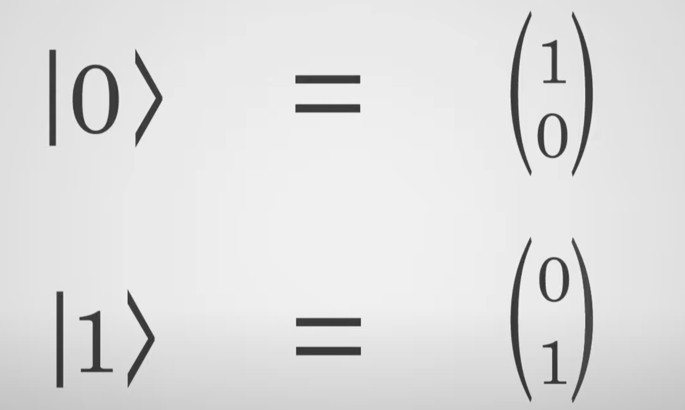
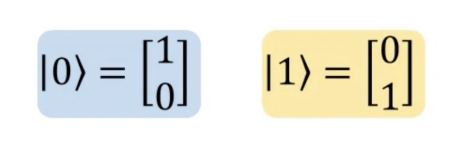
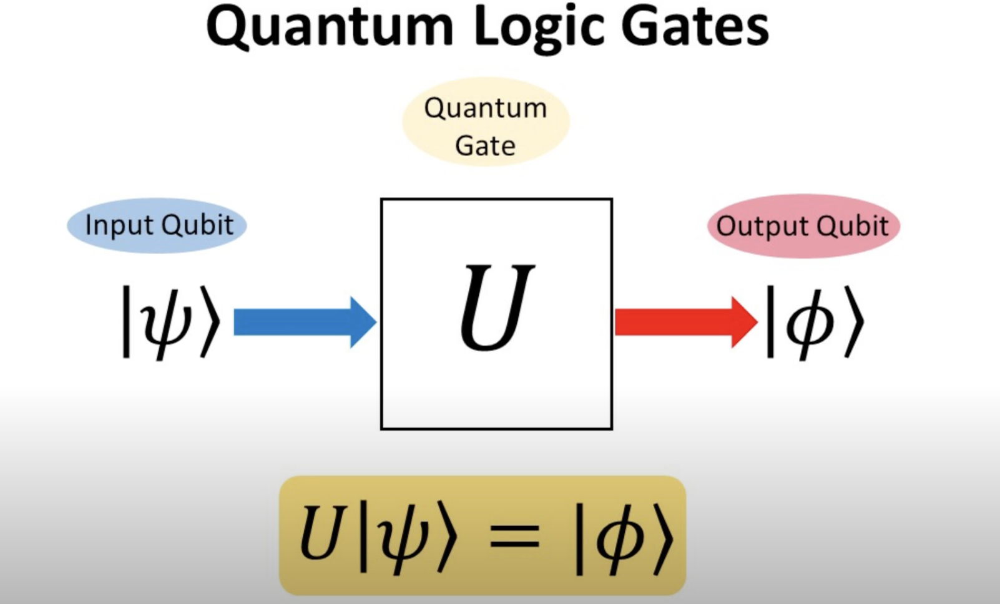

**Qubit:** [Further Details](https://www.ibm.com/topics/qubit)  
A qubit, or quantum bit, is the basic unit of information used to encode data in quantum computing and can be best understood as the quantum equivalent of the traditional bit used by classical computers to encode information in binary.
 Qubits are generally, although not exclusively, created by manipulating and measuring quantum particles (the smallest known building blocks of the physical universe), such as photons, electrons, trapped ions, superconducting circuits, and atoms. 

*How is a Qbit different from bit?* 
While each bit can be either a 0 or a 1, a single qubit can be either a 0, a 1, or a superposition. 
* It is not possible to determine if a qbit is in the state 0 or 1 unlike in a bit. We would rather need to find the values of alpha nd beta.
*Even when we measure a qbit's state, it gives us 0 or 1 with  aprobability value attached to it.

 
A quantum superposition can be described as *both 0 and 1, or as all the possible states between 0 and 1* because it actually represents the probability of the qubit’s state. 

**Quantum Superposition:**  
It is the state of a qubit formed by the linear combination of the two regular states 
alpha * 0 + beta*1  
The two states Cat 0 and Cat 1 form orthonormal (orthogonal to each other with a magnitude of 1 as seen in the image above) bases for the vector space (of Superposition).
*Matrix Representation of Qubits*:  
      

1. **Hadamard Gate**:
   - The Hadamard gate (H gate) is a single-qubit gate that creates a superposition state from a basis state. It transforms the basis states |0⟩ and |1⟩ into an equal superposition of both states.
   - Mathematically, it is represented as:
     \[
     H = \frac{1}{\sqrt{2}} \begin{pmatrix}
     1 & 1 \\
     1 & -1
     \end{pmatrix}
     \]

2. **State of Superposition**:
   - Superposition is a fundamental principle of quantum mechanics where a quantum system can be in multiple states at once. For a qubit, this means it can be in a combination of the |0⟩ and |1⟩ states.
   - A general superposition state is written as:
     \[
     |\psi⟩ = \alpha|0⟩ + \beta|1⟩
     \]
     where \(\alpha\) and \(\beta\) are complex numbers such that \(|\alpha|^2 + |\beta|^2 = 1\).

3. **State of Entanglement**:
   - Entanglement is a quantum phenomenon where the states of two or more qubits become interconnected such that the state of one qubit cannot be described independently of the state of the other qubits.
   - An example of an entangled state is the Bell state:
     \[
     |\Phi^+\rangle = \frac{1}{\sqrt{2}} (|00\rangle + |11\rangle)
     \]

4. **Other Quantum Gates for Basic Tasks**:

- **Pauli-X Gate (NOT Gate)**: Flips the state of a qubit (|0⟩ to |1⟩ and |1⟩ to |0⟩). This is similar to the NOT gate in classical computers. It is used to invert the state of a qubit.
  $$
  X = \begin{pmatrix}
  0 & 1 \\
  1 & 0
  \end{pmatrix}
  $$
  - **Details**: The Pauli-X gate is a fundamental quantum gate that performs a bit-flip operation. It is analogous to the classical NOT gate, which inverts the binary state. In quantum computing, applying the Pauli-X gate to a qubit in state |0⟩ will change it to |1⟩, and vice versa.

- **Pauli-Y Gate**: Similar to the X gate but introduces a phase shift. It combines a bit flip with a phase flip.
  $$
  Y = \begin{pmatrix}
  0 & -i \\
  i & 0
  \end{pmatrix}
  $$
  - **Details**: The Pauli-Y gate is another fundamental quantum gate that not only flips the state of the qubit but also introduces a complex phase factor. This gate is particularly useful in certain quantum algorithms where both bit and phase flips are required.

- **Pauli-Z Gate**: Introduces a phase shift to the |1⟩ state. It leaves the |0⟩ state unchanged and flips the sign of the |1⟩ state.
  $$
  Z = \begin{pmatrix}
  1 & 0 \\
  0 & -1
  \end{pmatrix}
  $$
  - **Details**: The Pauli-Z gate is used to apply a phase shift to the qubit. It leaves the |0⟩ state unchanged but multiplies the |1⟩ state by -1. This gate is essential in quantum algorithms that require phase manipulation.

- **CNOT Gate (Controlled-NOT Gate)**: A two-qubit gate that flips the second qubit (target) if the first qubit (control) is |1⟩. It is essential for creating entanglement between qubits.
  $$
  \text{CNOT} = \begin{pmatrix}
  1 & 0 & 0 & 0 \\
  0 & 1 & 0 & 0 \\
  0 & 0 & 0 & 1 \\
  0 & 0 & 1 & 0
  \end{pmatrix}
  $$
  - **Details**: The CNOT gate is a crucial two-qubit gate in quantum computing. It performs a NOT operation on the target qubit only when the control qubit is in the state |1⟩. This gate is fundamental for creating entangled states, which are a key resource in many quantum algorithms and protocols.

- **Phase Gate**: Introduces a phase shift to the qubit. It is used to change the relative phase between the |0⟩ and |1⟩ states.
  $$
  S = \begin{pmatrix}
  1 & 0 \\
  0 & i
  \end{pmatrix}
  $$
  - **Details**: The Phase gate (often denoted as S) applies a phase shift to the qubit. It multiplies the |1⟩ state by the imaginary unit \(i\), leaving the |0⟩ state unchanged. This gate is useful in various quantum algorithms where precise phase control is required.